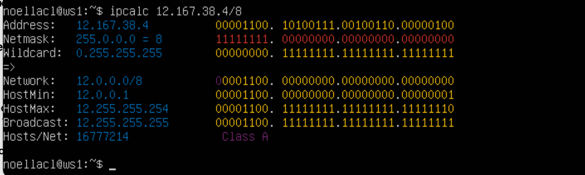
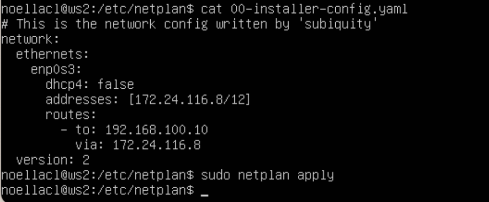

## Part 1

Start a virtual machine (hereafter -- ws1)

### Part 1.1

1. Адрес сети 192.167.38.54/13 - 192.160.0.0

``ipcalc 192.167.38.54/13``

2. Перевод маски 255.255.255.0 в префиксную и двоичную запись, /15 в обычную и двоичную, 11111111.11111111.11111111.11110000 в обычную и префиксную

- /24 - префиксканая 
- 11111111.11111111.11111111.00000000 - двоичная запись

``ipcacl 255.255.255.0``

- 255.254.0.0
- 11111111.11111111.00000000.00000000

``ipcalc /15``

- 255.255.255.240
- /28

``ipcalc 11111111.11111111.11111111.11110000``

3. Минимальный и максимальный хост в сети 12.167.38.4 при масках: /8, 11111111.11111111.00000000.00000000, 255.255.254.0 и /4

- /8
    - 12.0.0.1
    - 12.255.255.254

- /4
    - 0.0.0.1
    - 15.255.255.254

- /16 = 11111111.11111111.00000000.00000000
    - 12.167.0.1
    - 12.167.255.254

- /23 = 255.255.254.0
    - 12.167.38.1
    - 12.167.39.255

### Part 1.2

Определить и записать в отчёт, можно ли обратиться к приложению, работающему на localhost, со следующими IP: 194.34.23.100, 127.0.0.2, 127.1.0.1, 128.0.0.1

- 194.34.23.100 -> не работает
- 127.0.0.2 -> работает
- 127.1.0.1 -> работает
- 128.0.0.1 -> не работает

### Part 1.3

1. Какие из перечисленных IP можно использовать в качестве публичного, а какие только в качестве частных: 10.0.0.45, 134.43.0.2, 192.168.4.2, 172.20.250.4, 172.0.2.1, 192.172.0.1, 172.68.0.2, 172.16.255.255, 10.10.10.10, 192.169.168.1

>Частные Ip-адреса 
>От 10.0.0.0 до 10.255.255.255 с маской 255.0.0.0 или /8 
>От 172.16.0.0 до 172.31.255.255 с маской 255.240.0.0 или /12 
>От 192.168.0.0 до 192.168.255.255 с маской 255.255.0.0 или /16 
>От 100.64.0.0 до 100.127.255.255 с маской подсети 255.192.0.0 или /10

``10.0.0.45`` -  Частный 
``134.43.0.2`` - Публичный 
``192.168.4.2`` - Частный 
``172.20.250.4`` - Частный 
``172.0.2.1`` - Публичный 
``192.172.0.1`` - Публичный 
``172.68.0.2`` - Публичный 
``172.16.255.255`` - Частный 
``10.10.10.10`` - Частный 
``192.169.168.1`` - Публичный

2. Какие из перечисленных IP адресов шлюза возможны у сети 10.10.0.0/18: 10.0.0.1, 10.10.0.2, 10.10.10.10, 10.10.100.1, 10.10.1.255

Диапозон от 10.10.0.1 до 10.10.63.254

``10.0.0.1`` - нет 
``10.10.0.2`` - да 
``10.10.10.10`` - да 
``10.10.100.1`` - нет 
``10.10.1.255`` - нет

## Part 2

Поднять две виртуальные машины (далее -- ws1 и ws2)

``ip a``

- ws1

- ws2

Описать сетевой интерфейс, соответствующий внутренней сети, на обеих машинах и задать следующие адреса и маски: ws1 - 192.168.100.10, маска /16, ws2 - 172.24.116.8, маска /12

- ws1

- ws2

### Part 2.1

Добавить статический маршрут от одной машины до другой и обратно при помощи команды вида ``ip r add`` 
Пропинговать соединение между машинами

``sudo ip r add 172.24.116.8 dev enp0s3``

``ping 172.24.116.8``

``sudo ip r add 192.168.100.10 dev enp0s3``

``ping 192.168.100.10``

### Part 2.2

- Перезапустить машины
- `sudo reboot` x2

- Добавить статический маршрут от одной машины до другой с помощью файла *etc/netplan/00-installer-config.yaml*

- ws1

- ws2

- Пропинговать соединение между машинами

- ws1
``ping -c 4 172.24.116.8``

- ws2
``ping -c 4 192.168.100.10``
