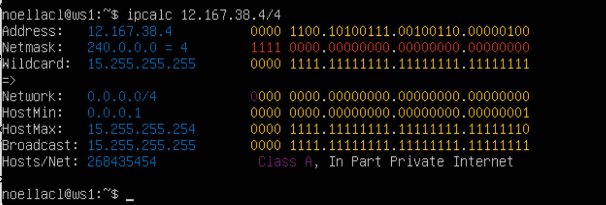

## Part 1. Инструмент **ipcalc**

- Поднять виртуальную машину (далее -- ws1)
Мануал `ipcalc` можно прочесть [здесь](https://www.opennet.ru/man.shtml?topic=ipcalc&category=1&russian=0).<br>

>**Описание** <br>
***ipcalc*** предоставляет простой метод для вычисления IP-информации хоста. Различные опции определяют, какую информацию ipcalc должен вывести на стандартный выход. Могут быть заданы несколько опций. Обрабатываемый IP-адрес всегда должен быть указан. Для большинства операций также требуется сетевая маска или префикс CIDR. 
>- **Некоторые из применений**:
>   - Проверить IP-адрес
>   - Показать рассчитанный широковещательный адрес
>   - Отображение имени хоста, определенного через DNS
>   - Показать сетевой адрес или префикс
- Обновим пакеты по необходимости:
  - `sudo apt-get update && sudo apt-get upgrade`
- Установим утилиту
  - `sudo apt-get -y install ipcalc`

### Part 1.1 Сети и маски

1. Адрес сети 192.167.38.54/13 - 192.160.0.0

``ipcalc 192.167.38.54/13``


2. Перевод маски 255.255.255.0 в префиксную и двоичную запись, /15 в обычную и двоичную, 11111111.11111111.11111111.11110000 в обычную и префиксную

- /24 - префиксканая 
- 11111111.11111111.11111111.00000000 - двоичная запись

``ipcacl 255.255.255.0``


- 255.254.0.0
- 11111111.11111111.00000000.00000000

``ipcalc 0.0.0.0/15``
](img/ipcalc000015.png)

- 255.255.255.240
- /28

``ipcalc 0.0.0.0/28``

](img/ipcalc000028.png)

3. Минимальный и максимальный хост в сети 12.167.38.4 при масках: /8, 11111111.11111111.00000000.00000000, 255.255.254.0 и /4

- /8
    - 12.0.0.1
    - 12.255.255.254


- /4
    - 0.0.0.1
    - 15.255.255.254


- /16 = 11111111.11111111.00000000.00000000
    - 12.167.0.1
    - 12.167.255.254


- /23 = 255.255.254.0
    - 12.167.38.1
    - 12.167.39.255


### Part 1.2 localhost

>Определить и записать в отчёт, можно ли обратиться к приложению, работающему на localhost, со следующими IP: 194.34.23.100, 127.0.0.2, 127.1.0.1, 128.0.0.1

Диапазон IP адресов, которые предназначены для создания локальной сети -> 127.0.0.1 - 127.255.255.255

- 194.34.23.100 -> не работает
- 127.0.0.2 -> работает
- 127.1.0.1 -> работает
- 128.0.0.1 -> не работает

### Part 1.3 Диапазоны и сегменты сетей

>1. Какие из перечисленных IP можно использовать в качестве публичного, а какие только в качестве частных: 10.0.0.45, 134.43.0.2, 192.168.4.2, 172.20.250.4, 172.0.2.1, 192.172.0.1, 172.68.0.2, 172.16.255.255, 10.10.10.10, 192.169.168.1

Частные Ip-адреса<br>
От 10.0.0.0 до 10.255.255.255 с маской 255.0.0.0 или /8<br>
От 172.16.0.0 до 172.31.255.255 с маской 255.240.0.0 или /12<br>
От 192.168.0.0 до 192.168.255.255 с маской 255.255.0.0 или /16<br>
От 100.64.0.0 до 100.127.255.255 с маской подсети 255.192.0.0 или /10

``10.0.0.45`` -  Частный<br>
``134.43.0.2`` - Публичный<br>
``192.168.4.2`` - Частный<br>
``172.20.250.4`` - Частный<br>
``172.0.2.1`` - Публичный<br>
``192.172.0.1`` - Публичный<br>
``172.68.0.2`` - Публичный<br>
``172.16.255.255`` - Частный<br>
``10.10.10.10`` - Частный<br>
``192.169.168.1`` - Публичный


>2. Какие из перечисленных IP адресов шлюза возможны у сети 10.10.0.0/18: 10.0.0.1, 10.10.0.2, 10.10.10.10, 10.10.100.1, 10.10.1.255


Диапозон от 10.10.0.1 до 10.10.63.254

10.0.0.1 - нет<br>
10.10.0.2 - да<br>
10.10.10.10 - да<br>
10.10.100.1 - нет<br>
10.10.1.255 - да

## Part 2. Статическая маршрутизация между двумя машинами

Поднять две виртуальные машины (далее -- ws1 и ws2)


``ip a``

- ws1


- ws2


Описать сетевой интерфейс, соответствующий внутренней сети, на обеих машинах и задать следующие адреса и маски: ws1 - 192.168.100.10, маска /16, ws2 - 172.24.116.8, маска /12

- ws1


- ws2


### Part 2.1

Добавить статический маршрут от одной машины до другой и обратно при помощи команды вида ``ip r add``<br>
Пропинговать соединение между машинами

``sudo ip r add 172.24.116.8 dev enp0s3``

``ping 172.24.116.8``


``sudo ip r add 192.168.100.10 dev enp0s3``

``ping 192.168.100.10``


### Part 2.2

- Перезапустить машины
- `sudo reboot` x2

- Добавить статический маршрут от одной машины до другой с помощью файла *etc/netplan/00-installer-config.yaml*

- ws1


- ws2


- Пропинговать соединение между машинами

- ws1
``ping -c 4 172.24.116.8``


- ws2
``ping -c 4 192.168.100.10``


## Part 3. Утилита iperf3

>iPerf3 — консольная утилита. С ее помощью можно измерить максимальную пропускную способность сети между сервером ВКС и клиентом или провести нагрузочное тестирование канала связи для определения уровня потерь.

Здесь можно прочитать мануал на эту утилиту -> [iperf3](https://manpages.ubuntu.com/manpages/xenial/man1/iperf3.1.html)

### Part 3.1. Скорость соединения

>По аналогии с единицей измерения скорости физических тел — метров в секунду (м/с) — скорость интернет-соединения обычно указывают в битах в секунду (бит/с) и его производных: Кбит/с, Мбит/с, Гбит/с.

`Переведи и запиши в отчёт: 8 Mbps в MB/s, 100 MB/s в Kbps, 1 Gbps в Mbps.`

- 8 Mbps = 1 MB/s
- 100 MB/s = 800000 Kbps
- 1 Gbps = 1000 Mbps

### Part 3.2. Утилита iperf3

> - ``iperf3`` — это инструмент для измерения пропускной способности сети. Он может тестировать TCP или пропускная способность UDP. Для выполнения теста iperf3 пользователь должен установить как сервер, так и клиент
> - **Использование**<br>
>   - iperf3 -s [ options ]
>   - iperf3 -c [ options ]<br>
*-s* -> запуск серверного мода<br>
*-c* -> запустить в режиме клиента и подключиться к серверу

> Измерь скорость соединения между ws1 и ws2.

У нас включно только локальное соединение, поэтому для обоих машин делаем настройку сети
- NAT (network address translation) - механизм преобразования ссетевых адресов<br>
Network Address Translation - это механизм в сетях TCP/IP, позволяющий изменять IP адрес в заголовке пакета, проходящего через устройство маршрутизации трафика.


Затем корректируем наш yaml 


И сейчас устанавливаем саму утилиту iperf3<br>
`sudo apt install iperf3`

- ws1<br>
`iperf3 -s`


- ws2<br>
`iperf3 -c 192.168.100.10`


## Part 4. Сетевой экран
### Part 4.1 Утилита iptables

> Мануал на данную утилиту -> [здесь](https://www.opennet.ru/man.shtml?topic=iptables&category=8&russian=0)<br>
Более подробный вы можете найти -> [тут](https://losst.pro/nastrojka-iptables-dlya-chajnikov)
>- **iptables** - инструмент администрирования фильтра пакетов IPv4 и NAT 
> - **Использование `iptables`**<br>
> -A - добавить правило в цепочку;<br>
> -С - проверить все правила;<br>
> -D - удалить правило;<br>
> -I - вставить правило с нужным номером;<br>
> -L - вывести все правила в текущей цепочке;<br>
> -S - вывести все правила;<br>
> -F - очистить все правила;<br>
> -N - создать цепочку;<br>
> -X - удалить цепочку;<br>
> -P - установить действие по умолчанию.

Создай файл /etc/firewall.sh, имитирующий фаерволл, на ws1 и ws2:

```shell
#!/bin/sh

# Удаление всех правил в таблице «filter» (по-умолчанию).
iptables -F
iptables -X
```

`sudo touch /etc/firewall.sh`<br>
`sudo nano /etc/firewall.sh`
1. На ws1 применить стратегию когда в начале пишется запрещающее правило, а в конце пишется разрешающее правило (это касается пунктов 4 и 5)
2. На ws2 применить стратегию когда в начале пишется разрешающее правило, а в конце пишется запрещающее правило (это касается пунктов 4 и 5)
3. Открыть для машин доступ к 22 и 80 портам (ssh и http)
4. Запретить echo reply (машина не должна "пинговаться”, т.е. должна быть блокировка на OUTPUT)
5. Разрешить echo reply (машина должна "пинговаться")

- ws1
]()

- ws2


Разница в том что в первом файле первое правило запрета а во втором разрешения на отправку пакетов. Последующие правила будут игнорироваться

Запусти файлы на обеих машинах командами ``chmod +x /etc/firewall.sh и /etc/firewall.sh.``


### Part 4.2. Утилита nmap

- Командой **ping** найти машину, которая не "пингуется", после чего утилитой **nmap** показать, что хост машины запущен
*Проверка: в выводе nmap должно быть сказано: `Host is up`*
- В отчёт поместить скрины с вызовом и выводом использованных команд **ping** и **nmap**.

- `sudo apt install nmap`


- `ping 172.24.116.8`

- `sudo nmap 172.24.116.8`

- `ping 192.168.100.10`

- `sudo nmap 192.168.100.10`


## Part 5. Статическая маршрутизация сети

Подними пять виртуальных машин (3 рабочие станции (ws11, ws21, ws22) и 2 роутера (r1, r2)).


Для начала нам нужно настроить связь между ними

Настройки для роутера r1


Настройки для роутера r2


Затем после того как мы определили адаптеры для роутеров, подключаем к ним наши машины

Настройка для ws11


Для ws21


Для ws22


### Part 5.1. Настройка адресов машин

**Настрой конфигурации машин в etc/netplan/00-installer-config.yaml согласно сети на рисунке.**

- В отчёт помести скрины с содержанием файла etc/netplan/00-installer-config.yaml для каждой машины.

С помощью утилиты `netplan` настроим конфигурации машин

`sudo nano /etc/netplan/00-installer-config.yaml`


](img/netr2.png)

**Перезапусти сервис сети. Если ошибок нет, то командой ip -4 a проверь, что адрес машины задан верно. Также пропингуй ws22 с ws21. Аналогично пропингуй r1 с ws11.**

- В отчёт помести скрины с вызовом и выводом использованных команд.

>Перезапустим сервисы при помощи команды `sudo netplan apply`

>Проверим, что адреса машин заданы верно `ip -4 a`

- ws11

- ws21

- ws22

- r1

- r2


>Также пропингуй ws22 с ws21


> Аналогично пропингуй r1 с ws11.


### Part 5.2. Включение переадресации IP-адресов

**Для включения переадресации IP, выполни команду на роутерах:**<br>
`sysctl -w net.ipv4.ip_forward=1` При таком подходе переадресация не будет работать после перезагрузки системы.

- В отчёт помести скрин с вызовом и выводом использованной команды.
- r1


- r2


**Открой файл /etc/sysctl.conf и добавь в него следующую строку:**
`net.ipv4.ip_forward = 1` При использовании этого подхода, IP-переадресация включена на постоянной основе.

- В отчёт помести скрин с содержанием изменённого файла /etc/sysctl.conf.


### Part 5.3. Установка маршрута по-умолчанию

Пример вывода команды `ip r` после добавления шлюза:

```
default via 10.10.0.1 dev eth0
10.10.0.0/18 dev eth0 proto kernel scope link src 10.10.0.2
```

**Настрой маршрут по-умолчанию (шлюз) для рабочих станций. Для этого добавь default перед IP роутера в файле конфигураций.**

- В отчёт помести скрин с содержанием файла etc/netplan/00-installer-config.yaml;


Затем применем новые изменения `sudo netplan apply`


**Вызови `ip r` и покажи, что добавился маршрут в таблицу маршрутизации.**

- В отчёт помести скрин с вызовом и выводом использованной команды.


**Пропингуй с ws11 роутер r2 и покажи на r2, что пинг доходит. Для этого используй команду:**<br>
`tcpdump -tn -i eth0`

- В отчёт помести скрин с вызовом и выводом использованных команд.

Пинг не пройдёт, т.к. роутер "не знает" куда вернуть ответ, при этом передача пакетов с машины осуществляется. 

Чтобы посмотреть какие девайсы можно прослушать

> ` tcpdump -D ` 

Запускаем на ` r2 ` утилиту ` tcpdump `, она позволяет прослушать порты и вывести на экран информацию с каких IP адресов приходят пакеты. В данном случае слушаем интерфейс ` enp0s8 `

> ` tcpdump -tn -i enp0s8 `

Сначала на экране r2 будет пусто, идёт ожидание входящих пакетов

Запускаем ` ping ` на ` ws11 ` 

> ` ping -c 5 10.100.0.12`


На экране ` r2 ` должно появиться 


### 5.4. Добавление статических маршрутов

**Добавить в роутеры r1 и r2 статические маршруты в файле конфигураций. Пример для r1 маршрута в сетку 10.20.0.0/26:**
```shell
# Добавить в конец описания сетевого интерфейса eth1:
- to: 10.20.0.0
  via: 10.100.0.12
```
- В отчёт поместить скрины с содержанием изменённого файла *etc/netplan/00-installer-config.yaml* для каждого роутера.


**Вызвать `ip r` и показать таблицы с маршрутами на обоих роутерах. Пример таблицы на r1:**
```
10.100.0.0/16 dev eth1 proto kernel scope link src 10.100.0.11
10.20.0.0/26 via 10.100.0.12 dev eth1
10.10.0.0/18 dev eth0 proto kernel scope link src 10.10.0.1
```
- В отчёт поместить скрин с вызовом и выводом использованной команды.


**Запустить команды на ws11:**
`ip r list 10.10.0.0/[маска сети]` и `ip r list 0.0.0.0/0`
- В отчёт поместить скрин с вызовом и выводом использованных команд.
- В отчёте объяснить, почему для адреса 10.10.0.0/\[маска сети\] был выбран маршрут, отличный от 0.0.0.0/0, хотя он попадает под маршрут по-умолчанию.


Маршрут выбран другой так как машина ws11 соединена с сетью 10.10.0.0/18 по своему IP-адресу 10.10.0.2, для других адресов используется маршрут по умолчанию, который указан в файле 10.10.0.1

### Part 5.5. Построение списка маршрутизаторов

Пример вывода утилиты **traceroute** после добавления шлюза:
```
1 10.10.0.1 0 ms 1 ms 0 ms
2 10.100.0.12 1 ms 0 ms 1 ms
3 10.20.0.10 12 ms 1 ms 3 ms
```
**Запустить на r1 команду дампа:**<br>
`tcpdump -tnv -i enp0s8`<br>
-t -> не выводить время при выводе каждой строкчи дампа;<br>
-n -> не конвертировать адреса в имена;<br>
-v -> при синтаксическом анализе и выводить более подробную информацию. Например, печатаются время создания, общая длина и параметры IP-пакета. Также включает дополнительные проверки целостности пакетов, такие как проверка контрольной суммы заголовка IP и ICMP.<br>
-i enp0s8 -> Указывает, что захват пакетов должен происходить на сетевом интерфейсе с именем enp0s8. Вы можете заменить enp0s8 на имя интерфейса, который вы хотите использовать для захвата пакетов
##### При помощи утилиты **traceroute** построить список маршрутизаторов на пути от ws11 до ws21
- В отчёт поместить скрины с вызовом и выводом использованных команд (tcpdump и traceroute).

При помощи утилиты `traceroute` построим список маршрутизаторов на пути от ws11 до ws21.

- В отчёте, опираясь на вывод, полученный из дампа на r1, объяснить принцип работы построения пути при помощи **traceroute**.

>Каждый пакет проходит на своем пути определенное количество узлов, пока достигнет своей цели. Причем, каждый пакет имеет свое время жизни. Это количество узлов, которые может пройти пакет перед тем, как он будет уничтожен. Этот параметр записывается в заголовке TTL, каждый маршрутизатор, через который будет проходить пакет уменьшает его на единицу. При TTL=0 пакет уничтожается, а отправителю отсылается сообщение Time Exceeded.

>Команда traceroute linux использует UDP пакеты. Она отправляет пакет с TTL=1 и смотрит адрес ответившего узла, дальше TTL=2, TTL=3 и так пока не достигнет цели. Каждый раз отправляется по три пакета и для каждого из них измеряется время прохождения. Пакет отправляется на случайный порт, который, скорее всего, не занят. Когда утилита traceroute получает сообщение от целевого узла о том, что порт недоступен трассировка считается завершенной.

### Part 5.6. Использование протокола ICMP при маршрутизации

##### Запустить на r1 перехват сетевого трафика, проходящего через eth0 с помощью команды:
`tcpdump -n -i eth0 icmp`
##### Пропинговать с ws11 несуществующий IP (например, *10.30.0.111*) с помощью команды:
`ping -c 1 10.30.0.111`
- В отчёт поместить скрин с вызовом и выводом использованных команд.


##### Сохранить дампы образов виртуальных машин

**p.s. Ни в коем случае не сохранять дампы в гит!**

## Part 6. Динамическая настройка IP с помощью DHCP